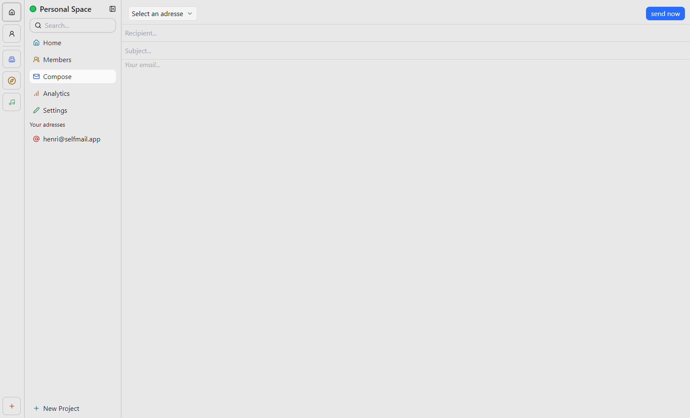

    <picture>
      
    </picture>
    <h2 align="center">
        📯 selfmail
    </h2>
    

        Your <b>own</b> email provider.
    

### What is selfmail?

Selfmail is an open-source email provider, built with nextjs and cloudflare email workers, which you can selfhost. Our platform is completely free to use, with no hidden textes. You can host the entire platform, or only the backend and building your frontend by yourself. If you want to use a hosted version then you should check our platform out [here](https://selfmail.app). You can start free, later you can upgrade to a paid plan for more space. All features (expect the ai features) are the same in every plan. (Paid plans are maybe coming in the future.)

### Getting started - local running

You can easily try selfmail on your local machine. Git, Docker, Node.js and bun are required to run selfmail. Please keep in mind, that you are not able to receive any emails. You can send emails with resend and use the ai features with a groq account. You'll need a server to receive emails with cloudflare workers.

### How can I selfhost selfmail?

A detailed documentation is on our [website](https://selfmail.app/docs). Here is a shord Guide:  

- install [docker](https://docker.com) on your machine
- insall the selfmail image
- provide a db conection string and your resend api key
  ... And your ready to start 🥳
  (docker image not avaiable yet)

---

Made by [henri](https://henri.gg) and the [community on github](https://github.com/i-am-henri/selfmail).

---

⚠️⚠️⚠️
This project is not ready yet. It's still in development, tests are misssing, the documentation is not started yet, there is for now only a basic and insecure version of the api, the docker image is not there and the smtp server is still not implemented. You can try it out, but please don't use this project in production.
