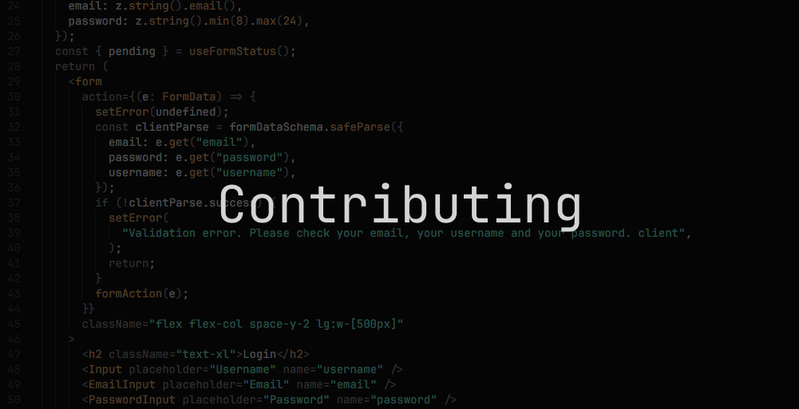

    
    <h2 align="center">Contributing</h2>
    

        <a href="https://github.com/selfmail/selfmail/">
            <b>🏡 Home</b> 
        </a>
        <a href="https://github.com/selfmail/selfmail/blob/main/LICENSE">
            <b>👨‍⚖️ License</b> 
        </a> 
        <a href="./">
            <b>📄 Guides</b> 
        </a>
        <a href="https://github.com/selfmail/selfmail/">
            <b>🙋 FAQ & Support & Feedback</b>
        </a>
    

## 📝 Contributing to this project

We are very happy to accept contributions from the community. To contribute, please follow these steps:

1. Fork the repository and create a new branch for your changes.
2. Make your changes and commit them with a clear and descriptive commit message.
3. Push your changes to your fork and submit a pull request.
4. Wait for the maintainers to review your changes and provide feedback.

If you follow al of these steps, your PR will be merged as soon as possible. Thank you for your contribution!

## 🏁 Start the project locally

To start the project locally, follow these steps:

1. Clone the repository to your local machine.
2. Install the required dependencies by running `pnpm install`.
3. Start the development server by running `pnpm dev`.
4. Open your browser and navigate to `http://localhost:3000` to view the homepage, to `http://localhost:4000` to view the dashboard, and to `http://localhost:6000` to view the docs. The api is available at `http://localhost:5000`.

## 🏗️ Build the project locally

We are using [turbo](https://turbo.build/) as the tool to manage the monorepo. This means you can easily run `pnpm build` in the root of your project to build the project. To start it in production, run `pnpm dev`.
